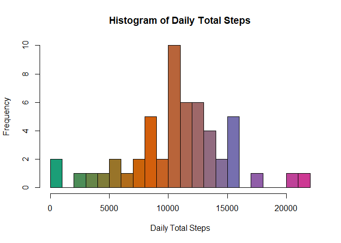
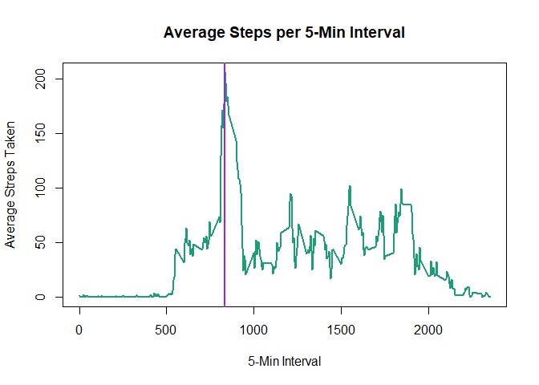
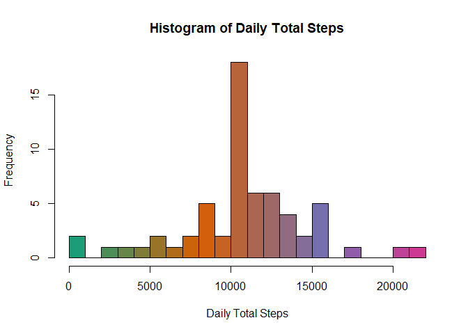
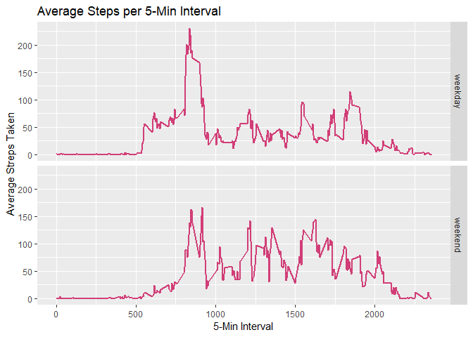

## Loading and preprocessing the data

```r
if (!file.exists("activity.csv")) { 
  unzip("activity.zip") 
}
data <- read.csv("activity.csv")
```


The data has **17568** observations of 3 varables: **steps** , **date** & **interval**

```r
dim(data)
```

```
## [1] 17568     3
```

```r
names(data)
```

```
## [1] "steps"    "date"     "interval"
```

```r
str(data)
```

```
## 'data.frame':	17568 obs. of  3 variables:
##  $ steps   : int  NA NA NA NA NA NA NA NA NA NA ...
##  $ date    : Factor w/ 61 levels "2012-10-01","2012-10-02",..: 1 1 1 1 1 1 1 1 1 1 ...
##  $ interval: int  0 5 10 15 20 25 30 35 40 45 ...
```

```r
summary(data)
```

```
##      steps                date          interval     
##  Min.   :  0.00   2012-10-01:  288   Min.   :   0.0  
##  1st Qu.:  0.00   2012-10-02:  288   1st Qu.: 588.8  
##  Median :  0.00   2012-10-03:  288   Median :1177.5  
##  Mean   : 37.38   2012-10-04:  288   Mean   :1177.5  
##  3rd Qu.: 12.00   2012-10-05:  288   3rd Qu.:1766.2  
##  Max.   :806.00   2012-10-06:  288   Max.   :2355.0  
##  NA's   :2304     (Other)   :15840
```

## What is mean total number of steps taken per day?

```r
dailyTotal <- data %>% group_by(date) %>% summarize(total = sum(steps))
cols <- colorRampPalette(brewer.pal(8,"Dark2"))(length(unique(dailyTotal$total)))
hist(dailyTotal$total,breaks=20,main="Histogram of Daily Total Steps",
     xlab="Daily Total Steps",ylab = "Frequency",col=cols)
```

<!-- -->

```r
mean(dailyTotal$total,na.rm = TRUE)
```

```
## [1] 10766.19
```

```r
median(dailyTotal$total,na.rm = TRUE)
```

```
## [1] 10765
```

## What is the average daily activity pattern?

```r
intervalAverage <- data %>% group_by(data$interval)%>% summarize(avg = mean(steps, na.rm = TRUE))
names(intervalAverage) <- c("interval","avg")
maxInt<-intervalAverage[intervalAverage$avg == max(intervalAverage$avg),"interval"]
maxInt
```

```
## # A tibble: 1 x 1
##   interval
##      <int>
## 1      835
```

```r
plot(x=intervalAverage$interval,y=intervalAverage$avg,type = "l",
     main="Average Steps per 5-Min Interval",xlab="5-Min Interval",
     ylab="Average Streps Taken",col=cols,lwd=2)
abline(v=maxInt,lwd=2,col="purple")
```

<!-- -->

## Imputing missing values

```r
summary(data$steps)
```

```
##    Min. 1st Qu.  Median    Mean 3rd Qu.    Max.    NA's 
##    0.00    0.00    0.00   37.38   12.00  806.00    2304
```
There are **2304** NA values as seen in the summary above

```r
imputedData<-data
imputedData<-merge(imputedData,intervalAverage , by="interval")
imputedData$steps = ifelse(is.na(imputedData$steps),imputedData$avg,imputedData$steps)
dailyImpTotal <- imputedData %>% group_by(date) %>% summarize(total = sum(steps))
hist(dailyImpTotal$total,breaks=20,main="Histogram of Daily Total Steps",
     xlab="Daily Total Steps",ylab = "Frequency",col=cols)
```

<!-- -->

```r
mean(dailyImpTotal$total,na.rm = TRUE)
```

```
## [1] 10766.19
```

```r
median(dailyImpTotal$total,na.rm = TRUE)
```

```
## [1] 10766.19
```

## Are there differences in activity patterns between weekdays and weekends?

```r
imputedData$date <- as.Date(imputedData$date)
imputedData$day <- weekdays(imputedData$date)
imputedData$weekend <- as.factor(ifelse(imputedData$day == "Saturday" |
                                          imputedData$day == "Sunday", "weekend", "weekday"))
intervalImpAverage <- imputedData %>% group_by(interval,weekend)%>%summarize(avg = mean(steps, na.rm = TRUE))
ggplot(intervalImpAverage, aes(interval, avg)) + geom_line(colour=cols[25],size=1) + facet_grid(weekend ~ .) +xlab("5-Min Interval") + ylab("Average Streps Taken")+ggtitle("Average Steps per 5-Min Interval")
```

<!-- -->
